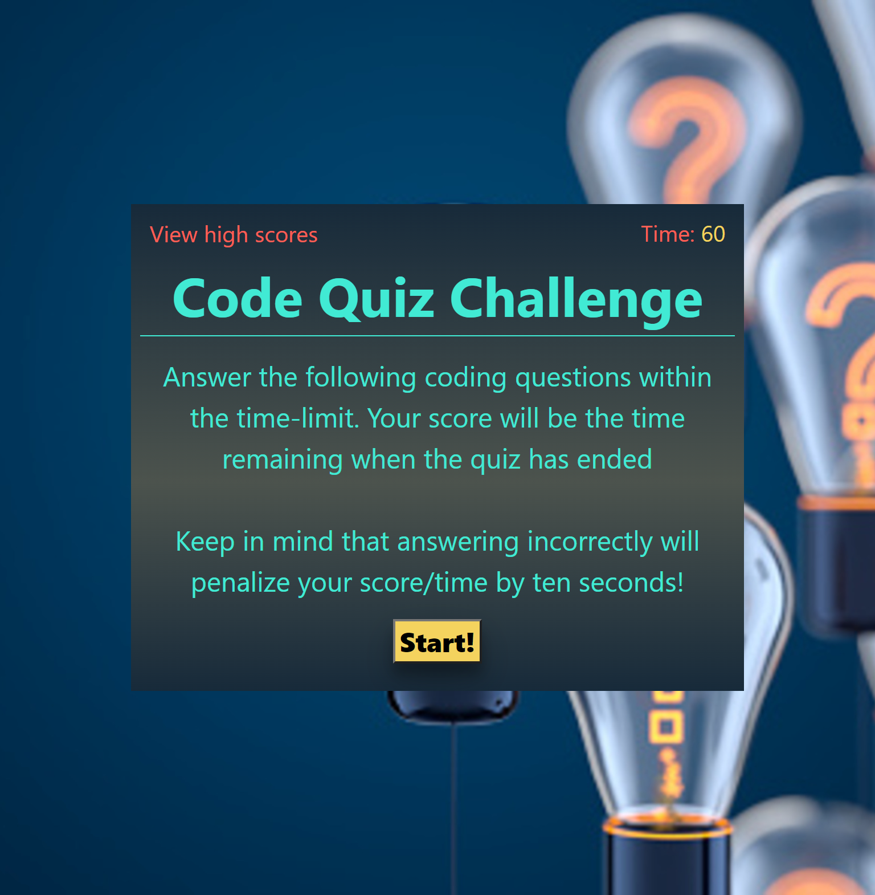

# Code Quiz

## Description

This project was focused on challenging newfound JavaScript skills. We were tasked to build a coding quiz game completely from scratch.

In this game, when you start the quiz a timer will begin to countdown. Your final score will be equal to the time remaining when you complete the quiz. Getting a question wrong will result in a deduction of 10 seconds. After the quiz is completed, you will be asked to enter your initials. Once submitted, you will be redirected to the high scores page, where you can see ranked players initials and scores.

## Motivation

Here is a list of my motivations for this project!

- Gain a better understanding for functions, localStorage, and JavaScript logic/flow
- Implement interval timer to create a scoring system
- Utilizing console.log to help me troubleshoot bugs
- Create another project fully from scratch 

## Deployed Webpage

[Click here to go to my fully deployed application!](https://erikbenedict.github.io/code-quiz/)

## Screenshots

## Author

Erik Benedict  
erik.r.benedict@gmail.com
